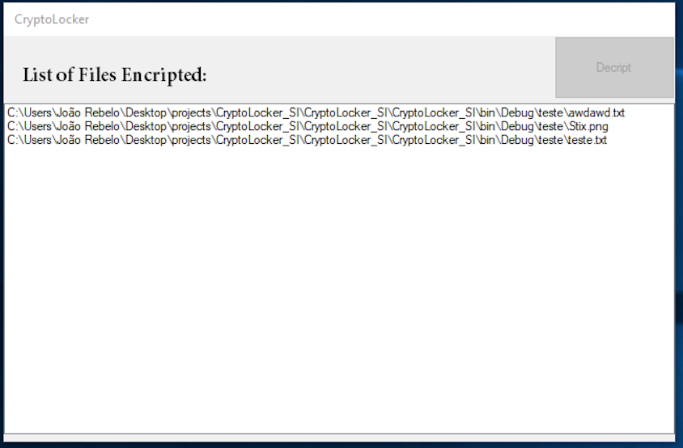

# CryptoLocker

An academic experiment in the application of encryption and decryption algorithms. Cryptolocker is a "virus-like" app that encyrpts files in exchange for fake money.

Written in C#.

This app demonstrates:

* encryption and decyption algorithms
* Windows system file manipulation
* Windows Forms programming

## Screenshots

User has files on computer:

The Cryptolocker app encrypts files so they are no longer accessible:

To decrypt, user must pay money (fake money, of course!)

After receiving fake money, files are unlocked:

Files are restored!

